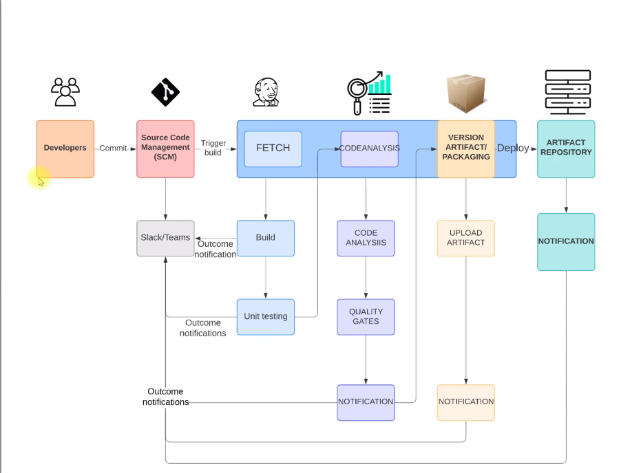

## Project5- Continuous integration using Jenkins, nexus, Sonarqube

### Problems

- In an agile SDLC, there will be frequent code changes.
- Not so frequently code will be tested
- which will accumulate bugs and error in the code.
- Developers need to rework to fix these bugs and errors.
- Manual build & release process.
- Inter team dependencies.

### Solutions

- Build & test for every commit.
- Automated Process.
- Notify for every build status
- Fix code if bugs or error found instantly rather than waiting.

### Tools

- Jenkins
- Git
- Maven
- Checkstyle
- Slack
- Nexus
- Sonarqube
- Amazon EC2

### Objective

- Fault Isolation
- Short MTTR(Mean time to recovery)
- Fast turn around on feature changes
- Less disruptive

### Architecture

```

```

The developer makes a code change and commits to a version control system or source code manager. An automation tool will automatically fetch that code, build it, run a unit test, and return the outcome on the Slack channel. In the next phase, it will run core analysis and core analysis. There will be quality gates. If it is not passing the threshold cap, then it's good. If it passes the threshold, a notification will be sent to the Slack channel. If this is good, it goes to the next level. Then the software will be built, it will be packaged and the artifact will be uploaded and its outcome notification will also be sent. The artifact or the software will be stored in the artifact repository. If all these stages are successful, then the software can be promoted to the next level. If there is any failure, the notification will be sent anyways. Once the developer receives the notification for any failure, they will make the code change, they'll make the fix and the process repeats again. So there will be regular code commits, and continuous code commits, and this process will run continuously.

### Flow of Execution:

1. Login to AWS
2. Create key pair
3. Create Security groups
   * Jenkins
   * Nexus
   * SonarQube
4. Create EC2 instances with user data
   * Jenkins
   * Nexus
   * SonarQube
5. Post Installation
   * Jenkins setup & Plugins
   * Nexus setup and repository setup
   * SonarQube login test
6. Git
   * Create a github repository & migrate code
   * Integrate github repository with VS Code & test it
7. Build job with Nexus integration
8. Github Webhook
9. SonarQube integration stage
10. Nexus artifact upload stage
11. Slack Notification
